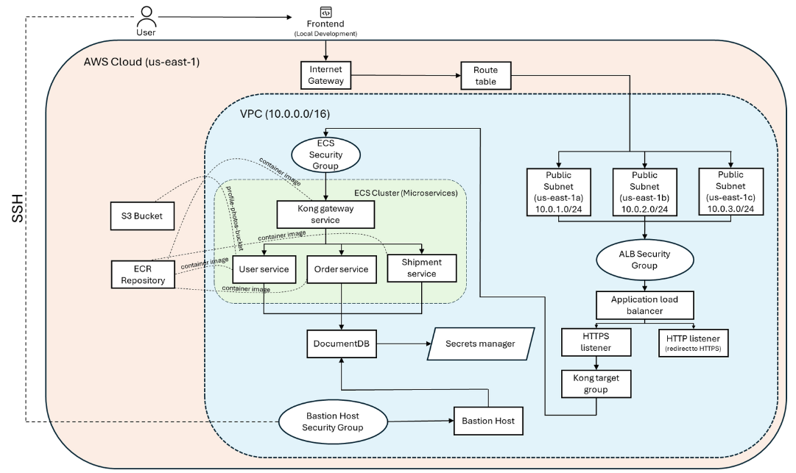

# Logistic System 🚚📦

**Logistic System** è una piattaforma **microservizi** per la gestione di flussi logistici: utenti, ordini, pagamenti e molto altro.  
I servizi sono containerizzati con **Docker**, orchestrati in locale con **Docker Compose**, mentre in AWS vengono eseguiti su **ECS** (con immagini ospitate in **ECR**).  
Per la persistenza dati si usa **MongoDB** (sia in locale che in cloud, a seconda del servizio).



---

## 📖 Sommario

- [Features](#-features)
- [Architettura](#-architettura)
- [Tecnologie](#-tecnologie)
- [Prerequisiti](#-prerequisiti)
- [Avvio in locale](#-avvio-in-locale)  
- [Deploy in AWS](#-deploy-in-aws)
- [Autori & Licenza](#-autori--licenza)  

---

## ✨ Features

- **Kong Gateway**: API Gateway per instradamento, sicurezza (JWT, rate limiting, autenticazione) e monitoraggio delle chiamate API
- **User Service**: gestione utenti, autenticazione e profili  
- **Order Service**: creazione, aggiornamento e tracking ordini  
- **Payment Service**: integrazione con Stripe per pagamenti  
- **Shipment Service**: gestione spedizioni e tracking  
- **Warehouse Service**: inventario magazzino  
- Frontend in **React** per dashboard e interfaccia utente  
- Infrastructure-as-Code con **Terraform**  

---

## 🏗 Architettura

- **Kong Gateway** funge da ingresso centralizzato: gestisce autenticazione, autorizzazione, rate limiting e monitoraggio delle chiamate API
- Ogni servizio è un container Docker  
- In locale, tutti i container sono orchestrati da Docker Compose  
- In cloud, **User** e **Order Service** girano su AWS ECS; tutti gli altri possono essere migrati facilmente  
- Database **MongoDB** per ogni servizio (deploy locali o cluster Atlas)  
- Rete VPC, Security Group e Load Balancer gestiti via Terraform  

---

## 🛠 Tecnologie

| Livello            | Tool / Framework                   |
|--------------------|------------------------------------|
| **Kong Gateway**   | Kong Gateway (plugin Lua custom per sicurezza)   |
| **Backend**        | Node.js, Express, Nodemon, Axios   |
| **Frontend**       | React, Axios, Nginx                |
| **DB**             | MongoDB                            |
| **Container**      | Docker, Docker Compose             |
| **Cloud**          | AWS ECS, ECR, VPC                  |
| **IaC**            | Terraform                          |
| **DevOps & Tools** | Git, Postman, VSCode (+ estensioni Docker, MongoDB, Terraform) |

---

## ⚙️ Prerequisiti

- **Git**  
- **Docker & Docker Compose**  
- **Node.js** (v14+)  
- **Terraform** (per il deploy AWS)  
- Credenziali AWS con accesso a ECS, ECR e VPC  

---

## ▶️ Avvio in locale

1. Clona il repo  
   ```bash
   git clone https://github.com/Daniele-byte/logistic-system.git
   cd logistic-system
2. Crea il file .env in ciascun service (es. backend/services/payment-service/.env) con le tue variabili:
   ```bash
   MONGO_URI=mongodb://localhost:27017/<db>
   STRIPE_SECRET_KEY=sk_test_...
   JWT_SECRET=tuo_jwt_secret
3. Avvia i container:
   ```bash
   docker-compose up --build
4. Apri il frontend: https://localhost:3000

## ☁️ Deploy in AWS
1. Inserimento credenziali AWS
   ```bash
   aws configure
2. Provisioning infrastruttura
   ```bash
   cd terraform
   terraform init
   terraform apply -auto-approve
3. Verifica modifiche su ECS
   Controlla la console AWS ECS per lo stato dei task e dei container

## License

This project is proprietary and confidential. All rights are reserved by the author.

For full licensing information, please refer to the [LICENSE](./LICENSE) file.


